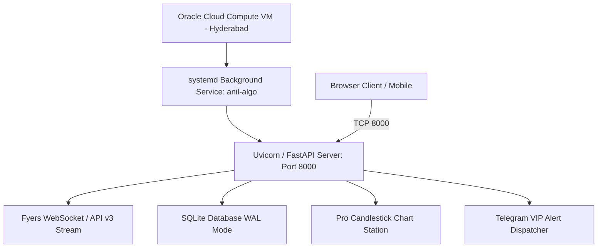

# ☁️ Oracle Cloud Infrastructure (OCI) Deployment Guide

**Target Instance OCID**: `ocid1.instance.oc1.ap-hyderabad-1.anuhsljrryd54bac7iplmahv2b7wq723nsawqugl4nlxfvm5fkly7hgg5g6a`  
**Region**: `ap-hyderabad-1` (Hyderabad, India)  
**Detected SSH Key**: `C:\Users\MyPc\Downloads\ssh-key-2026-08-27.key`  
**GitHub Repository**: [`https://github.com/anilbabu02/Anil-Trading-Algo.git`](https://github.com/anilbabu02/Anil-Trading-Algo.git)

---

## 1. Architecture Overview



---

## 2. Deployment Methods

### Method A: Direct SSH Deployment from Your Computer

Once you have your **Public IP Address** (e.g. `129.154.xxx.xxx`), run this command in PowerShell or Command Prompt:

```powershell
# 1. Connect to your Oracle VM using your private key
ssh -i "C:\Users\MyPc\Downloads\ssh-key-2026-08-27.key" opc@<YOUR_INSTANCE_PUBLIC_IP>

# (If using an Ubuntu image, use 'ubuntu@<YOUR_INSTANCE_PUBLIC_IP>')
```

Once connected to the VM, run the automated 1-click deployment script:

```bash
curl -sSL https://raw.githubusercontent.com/anilbabu02/Anil-Trading-Algo/main/scripts/deploy_oracle.sh | bash
```

---

### Method B: 1-Click Deployment via Oracle Cloud Shell / Console

1. Log in to [**Oracle Cloud Console**](https://cloud.oracle.com/).
2. Open **Cloud Shell** (top-right terminal icon) or SSH directly into your VM.
3. Paste and execute the deployment command:

```bash
curl -sSL https://raw.githubusercontent.com/anilbabu02/Anil-Trading-Algo/main/scripts/deploy_oracle.sh | bash
```

---

## 3. Oracle Cloud Network & Security List Setup (Crucial)

To access your trading dashboard from anywhere on the internet, Port `8000` must be permitted in your Oracle Virtual Cloud Network (VCN):

1. Go to **Networking** $\rightarrow$ **Virtual Cloud Networks**.
2. Click on your VCN $\rightarrow$ Select **Security Lists** $\rightarrow$ Click **Default Security List for `<your-vcn>`**.
3. Click **Add Ingress Rules** and enter:
   * **Source Type**: `CIDR`
   * **Source CIDR**: `0.0.0.0/0`
   * **IP Protocol**: `TCP`
   * **Source Port Range**: `All`
   * **Destination Port Range**: `8000`
   * **Description**: `ANIL BABU TRADES Web Dashboard`
4. Click **Add Ingress Rules**.

---

## 4. 24/7 Background Service Management (`systemd`)

The deployment script automatically installs `anil-algo.service` so the trading bot runs continuously without requiring an open terminal.

### Useful Server Commands:

| Action | Command |
| :--- | :--- |
| **Check Live Status** | `sudo systemctl status anil-algo` |
| **View Live Real-Time Logs** | `sudo journalctl -u anil-algo -f` |
| **Restart Service** | `sudo systemctl restart anil-algo` |
| **Stop Service** | `sudo systemctl stop anil-algo` |
| **Start Service** | `sudo systemctl start anil-algo` |

---

## 5. Updating the Code on Oracle Cloud

Whenever you push updates to GitHub, you can update your cloud server in seconds:

```bash
cd /opt/anil_babu_trades
git pull origin main
sudo systemctl restart anil-algo
```

---

## 6. Accessing Your Dashboard

Once deployed, open your browser and navigate to:
* **Trading Terminal**: `http://<YOUR_INSTANCE_PUBLIC_IP>:8000`
* **API Documentation**: `http://<YOUR_INSTANCE_PUBLIC_IP>:8000/docs`
